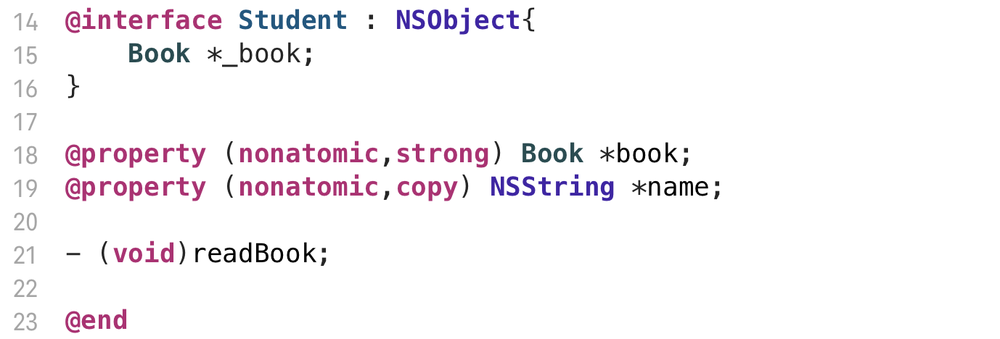

# @property

```objective-c
@property [(参数1,参数2,...)] <数据类型> <属性名>
```

- 编译器在编译这行代码的时候，会自动生成对应属性名的**setter**和**getter**的**声明**

```objc
@property NSString *name;
//等价于
//- (NSString *)name;
//- (void)setName:(NSString *)name;

@property int _no;
//等价于
//- (int)_no;
//- (void)set_no:(int)_no;
```

- 注意最原始 **@property** 就只是声明**setter**和**getter**方法，成员变量需要手动设置，**setter**和**getter**的实现也需要手写


# @synthesize

```objc
@synthesize <属性名> [= <成员变量名>]
```

- 编译器在编译这行代码的时候，会自动生成对应属性名的**setter**和**getter**的**标准实现**

```objc
@synthesize age;
//等价于
//- (void)setAge:(int)newAge {
//  	age = Age;
//}
```

- 注意下这里的 `age` 仅仅是**属性名** 和 **@property** 中定义的**对应**（函数的声明与实现应该对应）

- 默认情况下是**访问**与 **@property** **同名**的**成员变量**

- 后面经过一次更新， **@synthesize** 增强了，如果找不到该成员变量，则会**默认生成这个同名的(私有的)成员变量**

- 也就是说，理论上只要写了 **@property** 和 **@synthesize** 就够了，不用再去大括号里定义成员变量


### 但是

**Objective-C** 官方建议是成员变量是以下划线开头，目的是将**属性名**与**成员变量名**区分开

点语法调用的时候不含下划线，而实际上的成员变量名是由下划线的

 **@synthesize** 中的属性名肯定不能改，但是默认生成的是没有下划线的成员变量，如果类里面写了一个成员变量为_age, 又写了@synthesize age 

最终会有两个成员变量

- _age (定义的)
- age ( **@synthesize**  自动生成的)

最终使用还是age，_age属于无效定义


### 为了解决这个问题

 **@synthesize** 有另一种写法

```objc
@synthesize age = _age; //后面这个值代表了setter,getter将要访问谁,将要创建的成员变量是谁
//等价于
//- (void)setAge:(int)age {
//  	_age = age;
//}
```

这样写的好处在于，**属性名**（**setter**，**getter**的方法名）不变的同时，自动创建的成员变量是带有下划线的 (如果大括号中有声明就用大括号的，发现没有就自动创建)


# @property 增强版 ( Xcode >= 4.5 )

Xcode 4.5 之后，Apple对 **@property** 进行了一波增强

现在只需要写一句 **@property** ，无需写 **@synthesize**  就可以实现所有的功能

同样也是属于编译器特性

#### 增强的@property 做了以下几件事

- 生成**附加下划线的**对应属性名的成员变量

- 生成**setter**，**getter**的声明
- 生成**setter**，**getter**的实现

增强的**@property xxx; = @property xxx; + @synthesize xxx = _xxx;**

以后说**@property**，均指增强过后的**@property**


# 注意事项

### 同时重写setter和getter方法时，@property不会生成成员变量


解决方法有两种，**任选其一即可**

- 使用@synthesize 声明


这里的 **@synthesize** 只起到关联成员变量的作用，不会自动改变setter，getter的实现


- 使用大括号声明




### 使用@synthesize必须使用@property进行声明

否则编译会报错

```C
Property implementation must have its declaration in interface 'XXX' or one of its extensions
```


### @synthesize的优先级

 **@synthesize** 的优先级大于 **@property** 

如果@property int age; 

后面又写了个@synthesize age;

虽然说 **@property** 会生成 _age 的成员变量，但是 **@synthesize** 的优先级更高，这样写只会生成age，不会生成 _age


