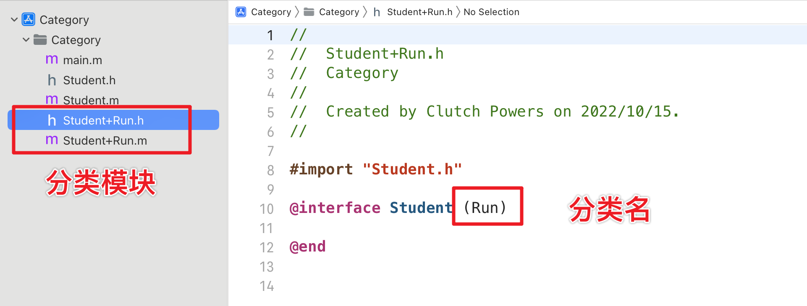

# Category 分类

- **Category** 是OC的Runtime特性，可以动态地为已经存在的类添加新的方法
- 这样可以保证类的原始设计规模较小，后期增加的时候再逐步扩展
- 使用 **Category** 增加方法，不需要创建子类
- **Category** 实现了方法的模块化，把类的方法分配到不同的分类文件中

注意声明分类必须 **import** ，不能用 **@class**

分类的作用是增加方法，所以必须要先知道原类已经存在的方法

使用分类需要额外导入分类的头文件

分类也可以写在同一个文件中，分文件是方便管理

⚠️ **Category 无法增加成员变量**

### Category 的使用场景

- 为写好的类添加新的方法
- 为系统SDK库中的类增加新的方法，比如 **NSString + JSON** 为NSString添加一个解析JSON的方法