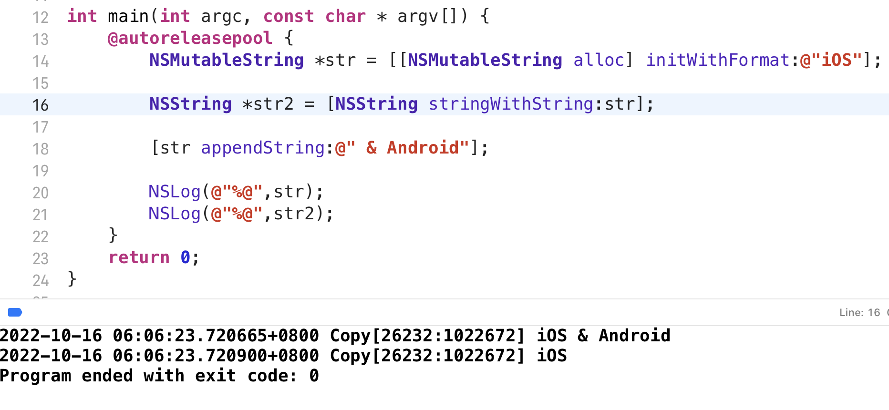

# Copy & mutableCopy

一个对象使用 **copy** 或 **mutableCopy** 方法可以创建一个对象的副本

- **copy** 需要实现 **NSCopying 协议** 创建的是**不可变副本**

- **mutableCopy** 需要实现 **NSMutableCopying 协议** 创建的是**可变副本** 

**copy** 操作会生成一个新的对象，引用计数为1，原对象引用计数不变

### Copy 操作

**Objective-C** 设计 **Copy** 操作的**目的是为了让赋值之后的值不被轻易改变**

或者 **改变副本的值，原对象不改变**

先来看看不用 **Copy** 的例子

**随着 str 的更改，str2 也相应改变**

如果使用 **copy**

**str2 的值不随 str 的值而变化**

### 其他类似 Copy 的操作

不调用 **Copy** 也能实现相同的效果

- 新创建对象

- 原对象重置

- 使用不可变对象

### 浅拷贝 & 深拷贝

- 浅拷贝：指针拷贝，新的指针和原指针都指向同一块内存

- 深拷贝：创建一个新的对象，将内存拷贝一份，赋值给新的指针

**copy** 产生的是不可变副本，由于原对象本身不可变，为了性能考虑，对不可变对象调用 **copy** 会返回原对象本身 （引用计数 + 1）

所以只有 **不可变对象** 调用 **copy** 方法 属于 **浅拷贝**

其他情况均为 **深拷贝**

**浅拷贝** 等价于 **retain**