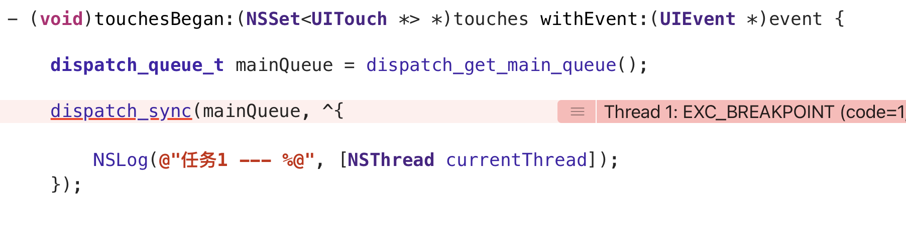

# GCD 相关知识

[TOC]

### GCD 简介

GCD ( **G**rand **C**entral **D**ispatch ) 是 Apple 开发的、C语言的多线程编程API

### GCD 的特点 

- GCD 会自动利用**多核处理器**进行并行运算
- GCD 会**自动管理线程的生命周期 ** （创建线程、调度任务）

开发者只需要定义**想执行的任务**并追加到适当的 **Dispatch Queue**（队列）中，GCD就能生成必要的线程并计划执行任务，**无需编写任何线程管理代码**

这里引出了两个 GCD 的核心概念 **任务** 和 **队列**

### GCD 核心概念1 : 任务

任务就是需要执行的**代码块**，在iOS中以 **Block** 的形式展现

执行任务，有两种方式，一种是**同步**，另一种是**异步**

#### 同步执行  dispatch_sync()

- **只能**在**当前线程**中执行任务，**不具备开启新线程的能力**
- 当前代码执行到 **dispatch_sync()** 时，线程会阻塞，等到 **dispatch_sync()** 传入的任务（Block）执行完毕，函数才会返回，代码才会往下走

#### 异步执行 dispatch_async()

- **可以**在**新创建的子线程**中执行任务，**具备开启新线程的能力**
- 当前代码执行到 **dispatch_async()** 时，当前线程不会阻塞，**dispatch_async()** 把任务（Block）加入队列后，就立即返回了，不管任务开没开始，执行情况怎么样，结没结束，代码都会往下走
- 这里异步执行只是具备开启新线程的能力，**不是一定会开启新线程**，是否开启新线程还与队列的类型有关

### GCD 核心概念2 : 队列

队列（**Dispatch Queue**）即用来**存放任务**的队列

队列是一种特殊的线性表，采用先进先出的原则

GCD会自动将队列中的任务取出，放到**对应的线程**中执行

读取任务则总是从队列的头部开始读取，每读一个任务，则从队列中释放一个任务

GCD中有两种队列，一种是**串行队列**，另一种是**并发队列**

#### 串行队列  Serial Dispatch Queue

- 每次只有一个任务被执行，一个任务执行完再执行下一个，一个接着一个执行

- 一个串行队列只能使用一个线程

#### 并发队列  Concurrent Dispatch queue

- 并发队列**可以**让多个任务并发执行 （注意这里不是一定，**并发队列只是有能力让队列中的任务多线程并发执行**，最终到底是怎么执行时需要看情况）

- 并发队列的**并发功能**只有在异步（**async**）执行任务方法**才有效**
- 并发队列中的任务也是**按先进先出**的方式**开始执行**， 但各任务结束时间，完成的顺序不确定 

# GCD 相关使用

GCD的使用分为两步

- 拿到一个队列
- 将任务放在队列中，GCD会根据**任务类型**和**队列类型**自动执行任务

## 拿队列

GCD中有两种方式拿到一个队列

- 创建一个新队列
- 取系统自带的队列
  - 主队列
  - 全局队列

### 创建新队列  dispatch_queue_create()

- 返回值  **dispatch_queue_t**  :  GCD队列类型

- 参数列表
  - label  :  队列的名称
  - attr  :  队列的属性
    - **NULL**或**DISPATCH_QUEUE_SERIAL** ：表示串行队列
    - **DISPATCH_QUEUE_CONCURRENT** ：表示并发队列

### 获取主队列  dispatch_get_main_queue()

主队列就是**主线程**中执行的队列

主线程只有一个，所以主队列是**串行队列**

往主队列中添加的任务会在**主线程**上执行

### 获取全局队列 dispatch_get_global_queue()

为了方便开发者使用，GCD提供了默认的全局队列供整个应用使用

全局队列是**并发队列**。全局队列拥有优先级的区别（用户界面，用户操作，周期操作，后台，默认）

- 返回值  **dispatch_queue_t**  :  GCD队列类型

- 参数列表
  - identifier  :  标识符 表示队列的优先级
    - **DISPATCH_QUEUE_PRIORITY_HIGH**  高优先级 值是 **2**
    - **DISPATCH_QUEUE_PRIORITY_DEFAULT**  默认优先级 值是 **0**
    - **DISPATCH_QUEUE_PRIORITY_LOW**  低优先级 值是 **-2**
    - **DISPATCH_QUEUE_PRIORITY_BACKGROUND**  后台 值是 **INT16_MIN** -**32768**
  - flags  :  保留参数，传0即可

## 放任务

GCD中有两种任务类型：**同步**执行的任务，**异步**执行的任务

### 同步执行  dispatch_sync()

- 返回值  void

- 参数列表
  - queue  :  一个GCD队列，表示将要放置任务的队列
  - block  :  需要执行的任务（代码块）

### 异步执行 dispatch_async()

- 返回值  void

- 参数列表
  - queue  :  一个GCD队列，表示将要放置任务的队列
  - block  :  需要执行的任务（代码块）

# GCD 任务与队列的组合方式

### 同步执行 + 串行队列

同步执行表示在**当前线程**中执行任务，不会开启新的子线程

任务是按顺序执行的，串行队列每次只有一个任务被执行，任务一个接一个执行

由于没有开新的子线程，在执行这三个任务的时候，主线程的UI是卡死的

### 同步执行 + 并发队列

虽然队列是并发队列，但是由于是**同步执行**，并发的功能失效，此时**相当于串行队列**

只有等**任务1执行完毕后**，**任务2才会添加进队列**

### 同步执行 + 主队列

所有放在主队列的任务，都会在主线程中执行

这里有几个点需要做出区分，假设现在有一个**任务1**，**同步地**往主队列中添加**任务1**

- **主队列** 和 **在主线程上执行的同步串行队列** 不一样
  - 主队列是更新UI的队列，一个程序只有一个主队列
  - 在主线程上执行的同步串行队列是**新创建的队列**，只不过这个队列在**主线程**上**同步地执行**

- **同步**地往**主队列**中添加了一个**任务1**，由于主队列是**串行队列**，所以**任务1**（也就是NSLog那一条指令）会添加到队尾
- 主队列在 **dispatch_sync()** 后面可能还会添加其他任务，无法保证**任务1**一定是在 **dispatch_sync()** 后面

- 由于是**同步**添加的**任务1**，主线程会阻塞，等待 **dispatch_sync()** 中的 **任务1**执行完毕后，才会继续执行后面的其他任务
- **任务1** 需要等前面的其他任务执行完毕后，才能执行，因为**主队列**是**串行队列**，这样就造成了**死锁**
- 其他任务在等待任务1，任务1在等待其他任务

避免上述死锁的方法

- 在**子线程**中使用主队列添加任务
- 在主线程中使用其他队列添加任务

**总之不要在主线程中往主队列同步添加任务**

### 异步执行 + 串行队列

异步执行具备开启新线程的能力，由于是**串行队列**，串行队列只能一个一个执行，所以只开一个子线程，任务都在子线程上执行，主线程不会阻塞，相对应的，UI不会卡顿

