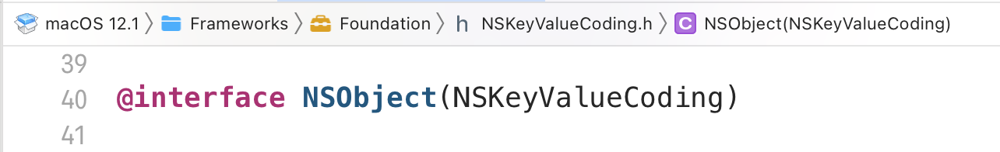
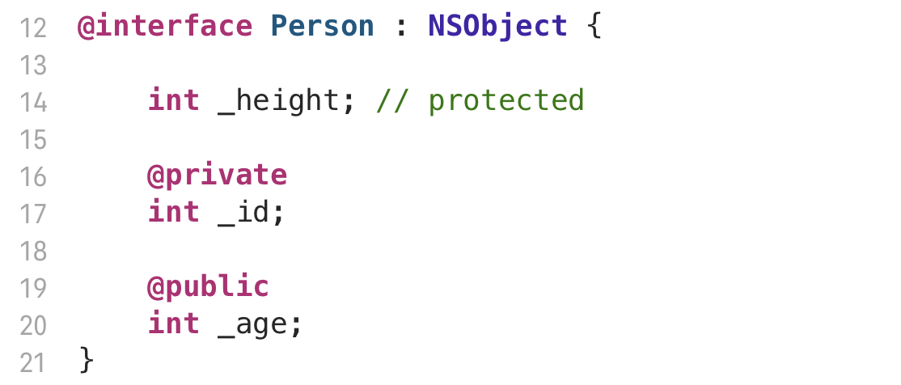
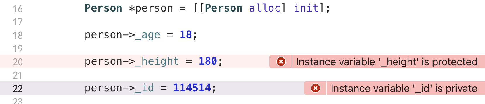
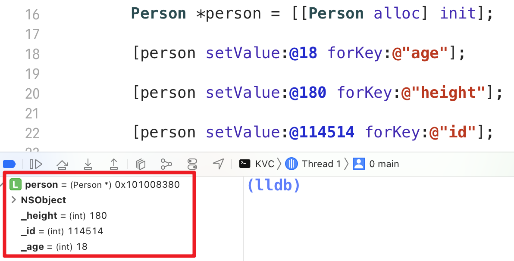
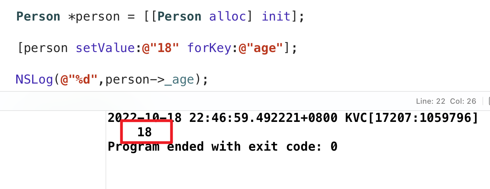

# KVC

**KVC** 的全称是 **K**ey **V**alue **C**oding （键值编码）

KVC允许开发者通过Key名直接访问对象的属性，或者给对象的属性赋值。而不需要调用明确的存取方法。这样就可以在运行时动态访问和修改对象的属性。而不是在编译时确定，这也是iOS开发中的黑魔法之一。

- **继承自NSObject的对象都支持KVC**

### 为什么要用KVC，不用点语法？

- KVC 可以访问，修改私有成员变量的值 (OC默认大括号里定义的成员变量是 **protected**)

在 KVC 面前，所有的东西都是透明的。

- KVC 支持**自动类型转换**

