# Protocol 协议

类似于 **Java** 的接口 （**interface**）

- **Protocol** 中声明了一系列的方法，只要一个类遵循了该协议，就可以实现这些方法

这种模式一般称为代理模式（**delegate**）

在 iOS 开发中，一般来说一个协议的名字都为 **xxxDelegate**

**Java** 的接口声明了就一定要实现，不实现就会报错，这一点 **Protocol** 不一样

**Protocol** 中可以将方法定义为

- **@required**  (默认值)："需要实现的"，不实现编译器会警告，不会报错
- **@optional** ："可选的"，可以不实现，一般来说已经有默认实现了

### 基本使用

#### 声明协议

在 OC 中，有一个最基本的协议 **NSObject** （这里的 **NSObject** 是协议的名称，不是类名）

如果我们要创建一个协议，在无特殊需求的情况下一般都会实现 **NSObject 协议**

这一点和所有类都要继承自 **NSObject** 一样，这样才能赋予面向对象的特性

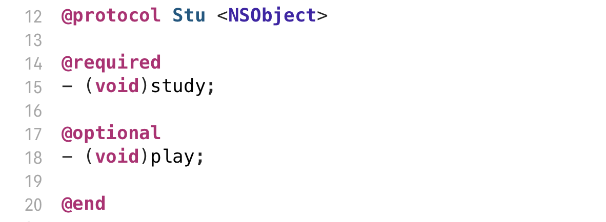

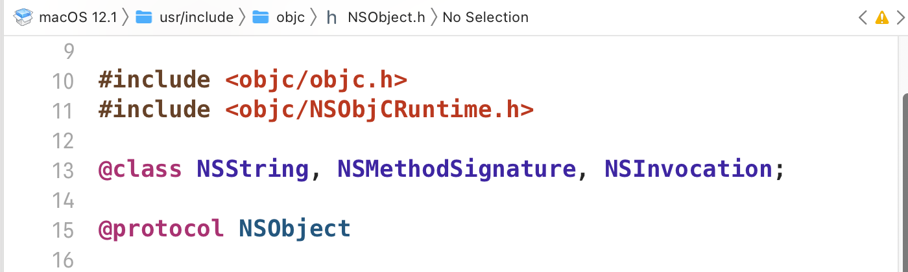

## 代理

一个类A，如果需要另一个类B去实现某些功能，就需要设置类B为类A的**代理对象**

代理对象的核心就是 **Protocol**

类A内部有一个成员变量，这个成员变量是**id类型**，不过这个id不是一般的id，是遵循了**A代理协议** 的id，A需要弱引用这个对象

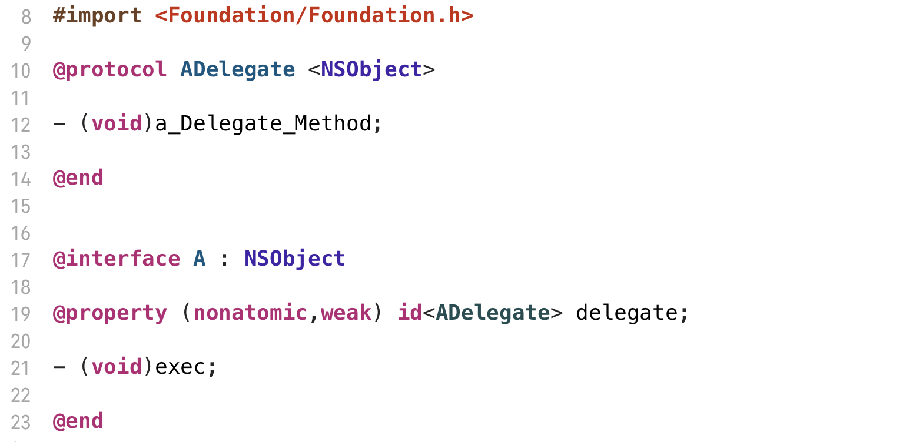

注意这里 **id** 本来就是指针（对象）类型，不用加星号

A的**exec**方法是去调用代理对象的方法

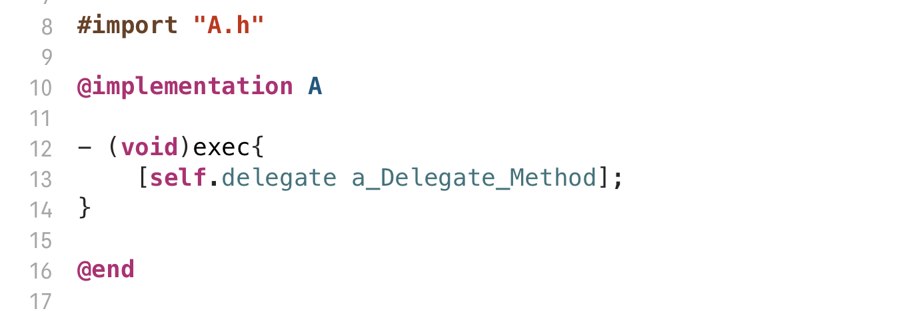

类B，**遵循了类A声明的代理协议**，就可以当做是**类A的代理对象**

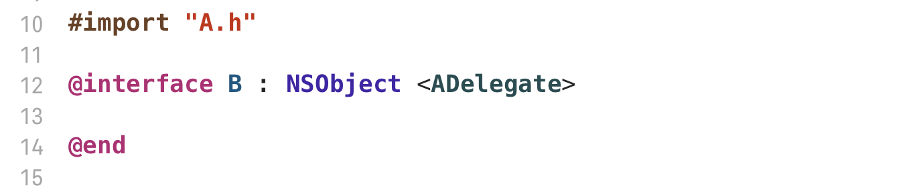

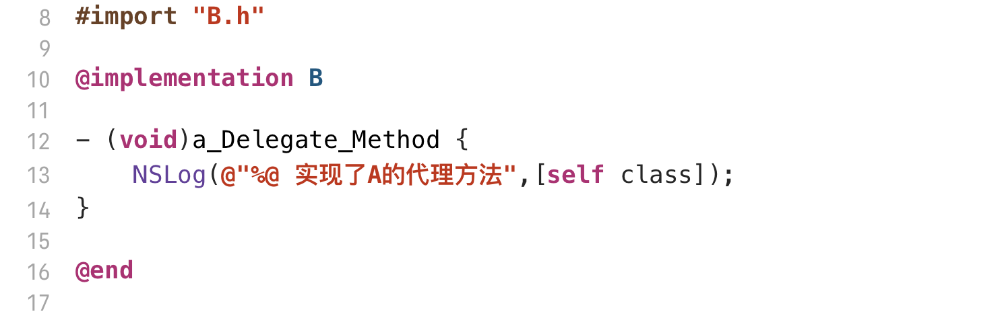

   

##### 实现

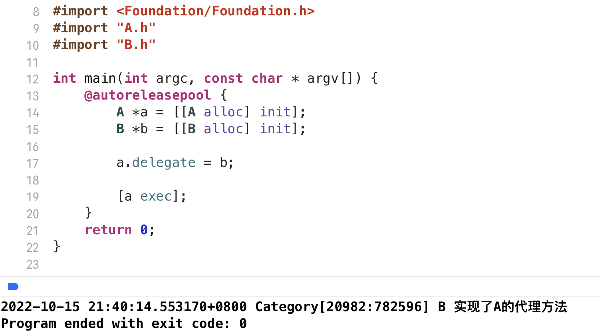

### 存在的问题

以上的情况是理想情况，B实现了A的代理方法，但是如果B没有实现，编译器只会警告（即使是 **@required**）

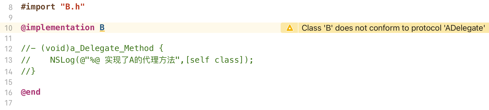

这样运行，一定会报错

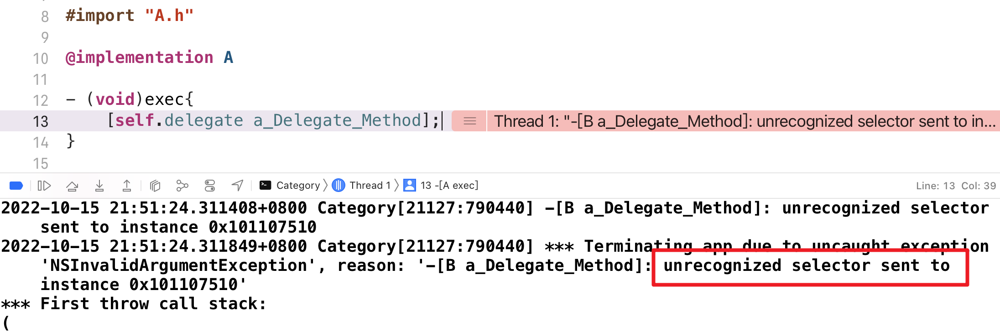

这个是 **Objective-C** 非常经典的报错，当一个类没有这个方法，而强行调用（发送消息）

OBJC_Runtime 无法处理该消息，直接报错

关于 **Runtime** 的详细内容，请参考另一篇文章

### 改进思路

在A内部调用代理对象的方法时，做出判断，如果无法处理，则不发送消息

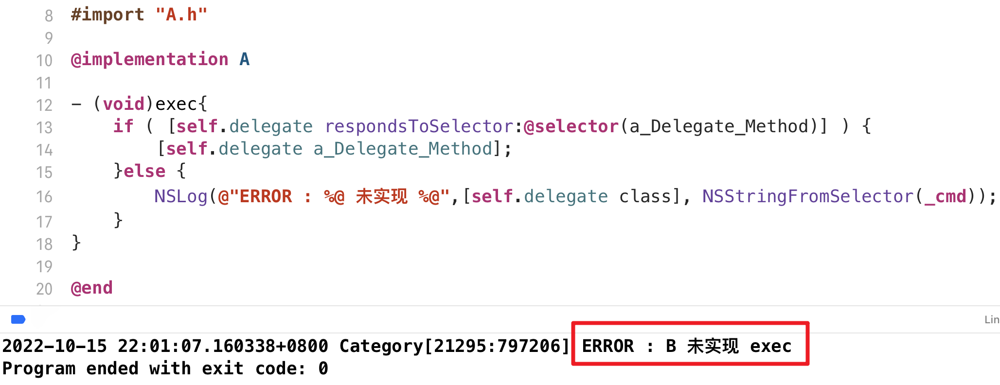

### 判断是否遵循协议

OC中有方法可以判断一个类是否遵循协议

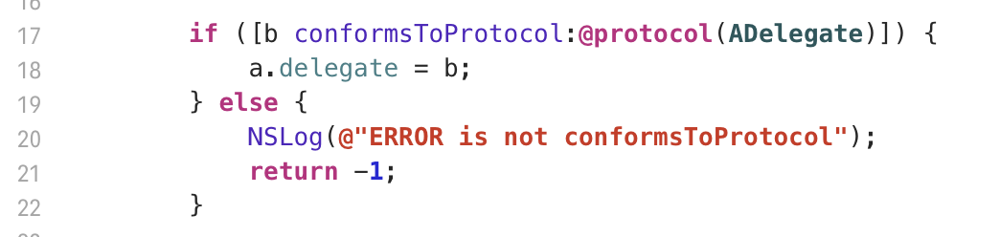
