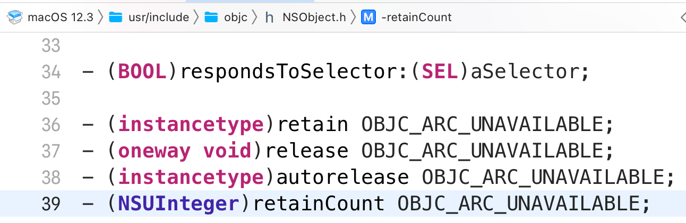

>对于任何编程语言来说，正确地管理内存是必不可少的。如果内存管理不当，就会导致内存泄露，出现野指针错误等问题

**Java**的内存是由运行中**JVM**的**GC**管理的，Java中没有指针，不过有和指针相似的概念，叫做**引用**。

当我们new一个Java对象的时候，我们通常会用一个引用来接受这个对象，那么这个引用的值就是new对象的内存地址，相当于这个引用指向了该内存区域。

当GC检测到一块内存没有引用指向它的时候，GC会回收掉这块内存，GC的过程对于程序员来说是隐式的，开发者无需像C/C++那样编写大量内存管理代码，一切交给GC即可

所以Java的开发效率一直比较高，开发者可以将全部精力放在业务代码上

# Objective-C 的内存管理

OC没有GC机制，在 iOS 5，Xcode 4.2 之前，开发者写OC（iOS）程序需要手动管理内存。

OC使用引用计数来管理内存

Xcode4.2 引入了新功能，自动引用计数（ **A**utomatic **R**eference **C**ounting ）简称 **ARC**

ARC的特性极大地降低了开发难度，为了和以前的手动管理内存（不用ARC）做出对比

手动管理内存（ **M**anual **R**eference **C**ounting ）简称为 **MRC**

### 引用计数

OC中 的所有对象（继承自NSObject）内部都有一个属性，叫做引用计数

当引用计数大于0时，对象的内存不会被回收

当引用计数减为0时，对象的内存将会**立即回收**

#### 内存回收的概念

通常我们说一块内存被回收，并不是这块内存的值被清空，而是标记为不可用

因为对内存读写是需要消耗性能，为了节约性能只需要标记不可用（无访问权限）即可

所以当对象的内存被回收时，对象的成员变量仍然存在于这块内存中

甚至可以通过指针来访问（C / C++）

存储对象内存是不可用状态，但是指向这块内存的指针仍然在栈里

这个指针指向了它不应该（或者说禁止）访问的内存，我们称这类指针为 **野指针**

引用计数通过对象方法 retainCount来获取

当我们调用**alloc/new/copy**方法开辟内存空间创建新对象的时候，这个对象的**引用计数器会加一**

即使不用一个指针（或者说对象）去指向它，这个对象的内存空间也不会被回收