>对于任何编程语言来说，正确地管理内存是必不可少的。如果内存管理不当，就会导致内存泄露，出现野指针错误等问题

**Java** 的内存是由运行中 **JVM** 的 **GC** 管理的，**Java **中没有指针，不过有和指针相似的概念，叫做**引用**。

当我们**new**一个**Java**对象的时候，我们通常会用一个引用来接受这个对象，那么这个引用的值就是**new**对象的内存地址，相当于这个引用指向了该内存区域。

当**GC**检测到一块内存没有引用指向它的时候，**GC**会回收掉这块内存，**GC**的过程对于程序员来说是隐式的，开发者无需像**C/C++**那样编写大量内存管理代码，一切交给**GC**即可

所以**Java**的开发效率一直比较高，开发者可以将全部精力放在业务代码上

# Objective-C 的内存管理

**Objective-C**没有**GC**机制，在 **iOS 5**，**Xcode 4.2** 之前，开发者写**Objective-C**（**iOS**）程序需要手动管理内存。

**Objective-C**使用引用计数来管理内存

**Xcode4.2** 引入了新功能，自动引用计数（ **A**utomatic **R**eference **C**ounting ）简称 **ARC**

ARC的特性极大地降低了开发难度，为了和以前的手动管理内存（不用ARC）做出对比

手动管理内存（ **M**anual **R**eference **C**ounting ）简称为 **MRC**

**TIPS**：在使用**MRC**时，最好开启**Xcode**的**内存诊断**，以免导致MRC看起来失效的错误

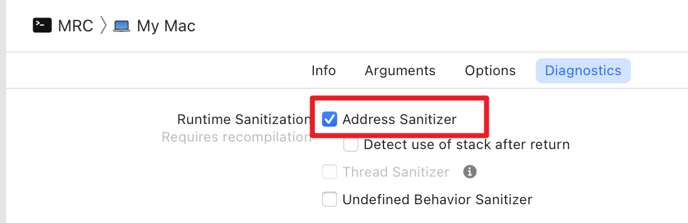 

## 引用计数

**Objective-C**中 的所有对象（继承自**NSObject**）内部都有一个属性，叫做引用计数

当**引用计数大于0**时，对象的内存不会被回收

当**引用计数减为0**时，对象的内存将会**立即回收**

### 内存回收的概念

通常我们说一块内存被回收，并不是这块内存的值被清空，而是标记为不可用

因为对内存读写是需要消耗性能，为了节约性能只需要标记不可用（**无访问权限**）即可

所以当对象的内存被回收时，对象的成员变量仍然存在于这块内存中

甚至可以通过指针来访问（**C / C++**）

存储对象内存是不可用状态，但是指向这块内存的指针仍然在栈里

这个指针指向了它不应该（或者说禁止）访问的内存，我们称这类指针为 **野指针**

**空指针**和**野指针**是不一样的概念，空指针是指不指向任何内存的指针（指针的值为0）

- 在 **Java** 中，使用空指针和野指针会直接报错

- 在 **Objective-C** 中，使用野指针会报错，(不能给野指针发送消息)，**给空指针发送消息不会报错**

## 内存管理的规则

- 谁创建，谁释放

一个函数中有创建，那就一定要有释放

不是你创建的，就不用你去释放

- 谁持有，谁负责

在开发过程中，很多时候一个类需要持有不是它本身创建的对象（其他类创建的）

持有了这个对象，就要对这个对象的生命周期负责，不需要的时候进行释放

引用计数通过对象方法 **retainCount** 来获取

### 创建对象

当我们调用**alloc/new/copy**方法开辟内存空间创建新对象的时候，这个对象的**引用计数器会加1**

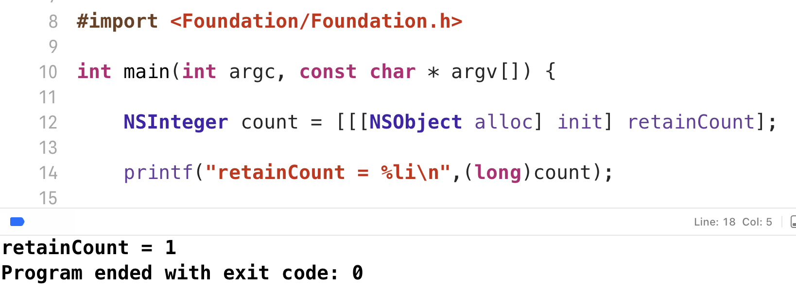

即使不用一个指针（或者说对象）去指向它，这个对象的内存空间也不会被回收

> 这一点和 **Java** 不一样，**Java** 新建对象后，如果不引用，那么内存就会被直接回收

### 持有对象

之前提到过，通常在开发过程中，一个类会以另一个类作为属性，通常这个属性对应的对象不是当前类创建的

另一个类创建完之后就会释放，所以我们需要在释放前持有这个对象（这个时候**引用计数为2**，**即使释放一次减1，还有1**），让这个对象的**引用计数不为0**，从而使用这个对象（不要让系统回收）

##### 持有对象的方法是 retain

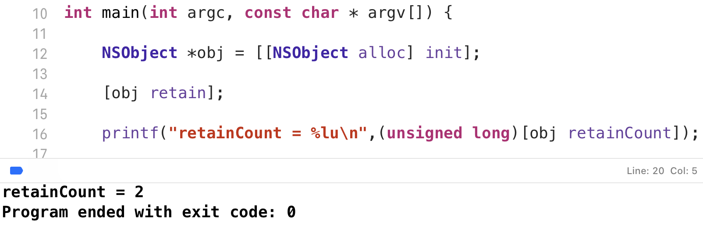

### 释放对象

当我们不需要一个对象的时候，如果是我们负责的，需要释放这个对象，否则会造成野指针错误

释放对象会让**引用计数减1**，**不是减为0**

##### 释放对象的方法是 release

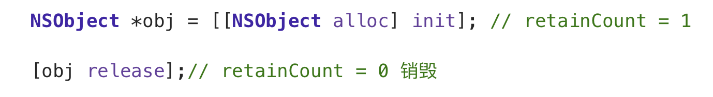

### 销毁对象

当一个对象的引用计数减为0时，**OC**将自动给这个对象发送一条**dealloc**消息, 调用对象的**dealloc**方法

重写**dealloc**方法时，要在最后调用父类的**dealloc**

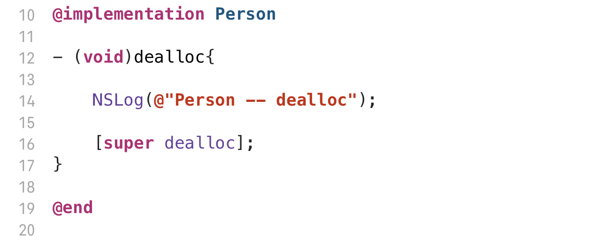

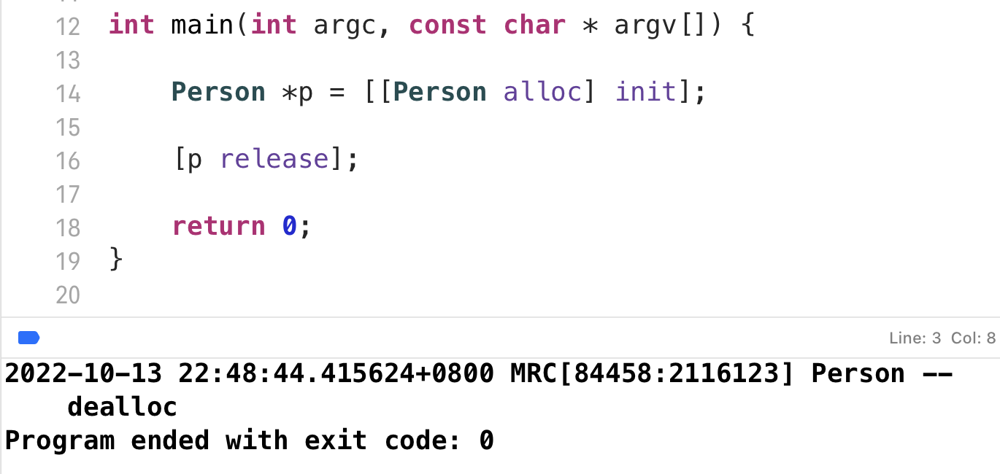

## 如何正确管理内存 （MRC）

全部使用**@property (retain)** 自动生成的**setter**，**getter**

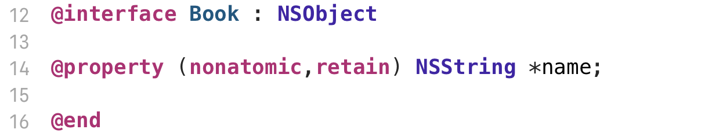

只重写**Book** 的 **dealloc**

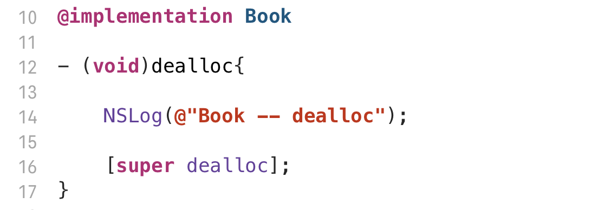

假设现在有一个学生类，书类

学生可以选一本书读，书作为学生的属性，学生有读书的方法

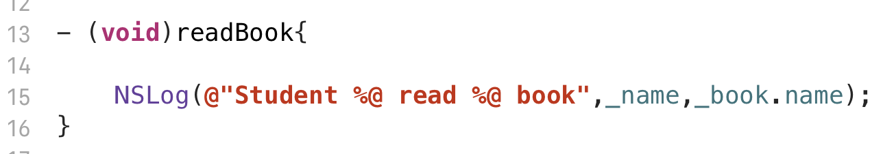

#### main.m

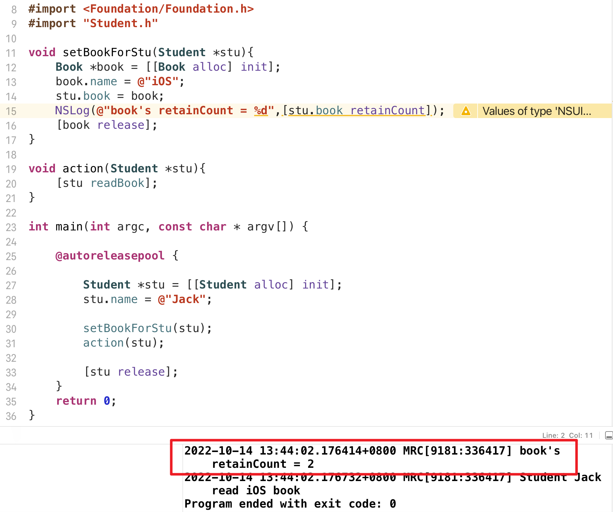

**stu**持有了**book**，**book**的**引用计数变为2**

可以看到释放**stu**之后，**book**并没有被释放

改进一下**Student**的**dealloc**方法，就可以解决

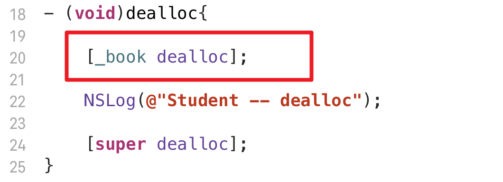

#### 改进之后运行

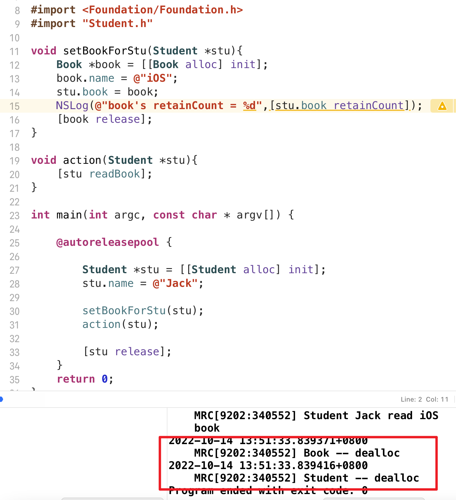

可以看到 **book** 成功释放

由此我们可以得出一个结论

- **@property (retain)**自动生成的**setter，getter**方法内部是有内存管理相关代码的，不仅仅是标准实现
- 想正确管理内存还需要重写**dealloc**方法，将成员变量释放掉

## 底层实现

首先看一下标准实现 **(@propery 不加参数的默认实现) **的问题

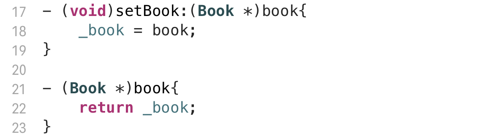

在 **main.m** 中 这个函数实现本身没有问题，因为遵循 **谁创建，谁释放** 的规则

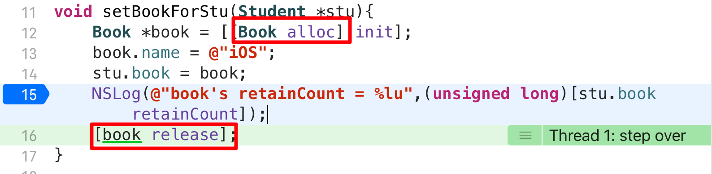

第14行调用了 **setBook** 方法，**setBook**方法内部没有对**book**进行任何处理

16行结束后，**book**的引用计数变为**0**，**被立即释放**

导致后面访问**book**就会报错（野指针错误）

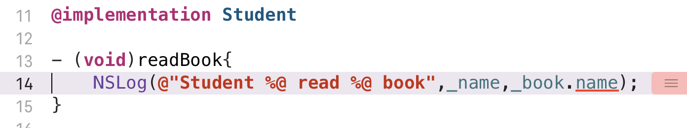

### 分析原因

为什么会出现野指针错误？**setBookForStu()**这个函数本身没有任何问题，**book**对象是它创建的，所以在这个函数执行完毕时，必须要将**book**释放（假设没有其他人使用）

但问题在于，**函数内有个stu**，**它需要持有book对象**，持有是调用**stu**的 **setBook**方法

**setBook**方法内部并没有对**book** 进行**retain**操作，引用计数没有增加，第16行执行完后，**book**被回收，就变成了一个**野指针**

怎样保证**book**不被回收呢，只需要在持有的时候**调用一次retain**，让**引用计数+1** 变成 **2**，这样即使原调用者**释放一次**，**引用计数还有1**

### 改进思路1

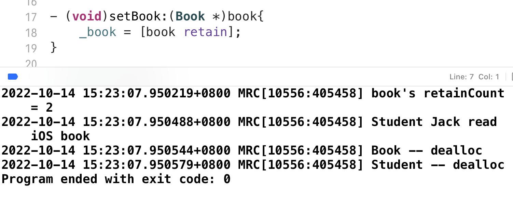

这样写至少可以正常运行了，不过仍然不够严谨

在开发过程中，通常要对一个属性**多次赋值**，也就是**多次持有**

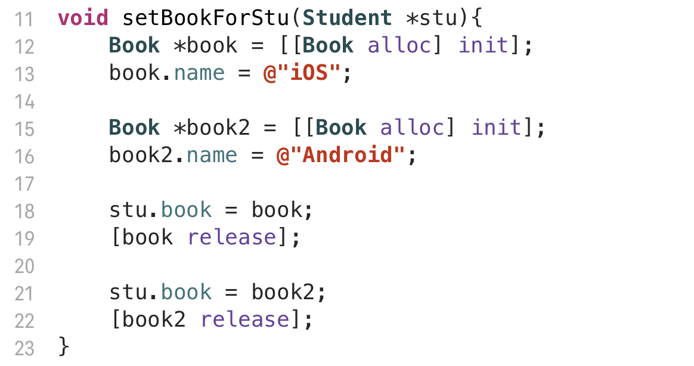

**这样写会导致内存泄露 book2 （Android） 正常释放，book （iOS）没有正常释放**

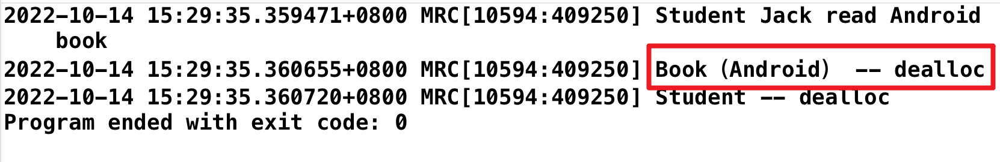

### 改进思路2

在持有之前，先释放掉之前持有的对象，然后再持有进的对象

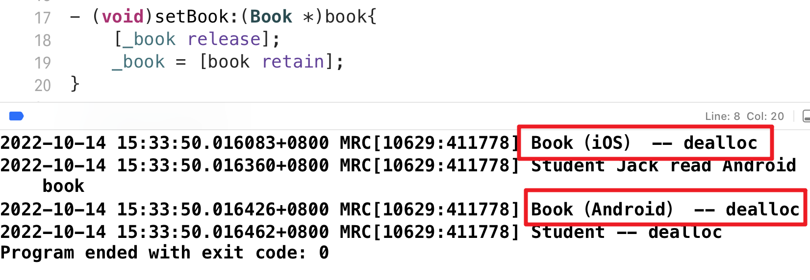

看起来已经没有什么问题了，不过**还有一种情况需要考虑**

假设代码写多了，有一个持有的操作放到了释放之后

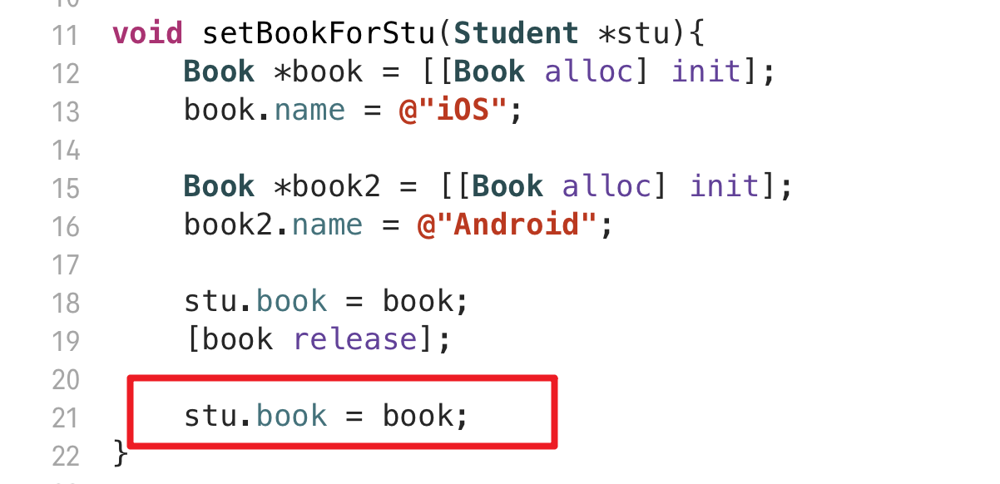

很显然会报野指针错误，因为**book已经释放**了，无法再**retain**

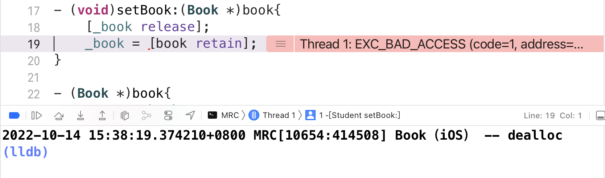

### 改进思路3  (最完美写法，@property (retain) 的实现)

如果传进来的对象和已经持有的对象一致，则不进行任何操作

换句话说，只有当对象真正修改的时候

- **nil** 变为 **book**
- **book** 变为 **book2**

才去调用 **retain**

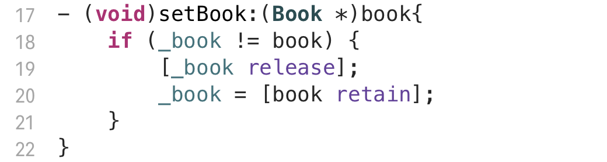

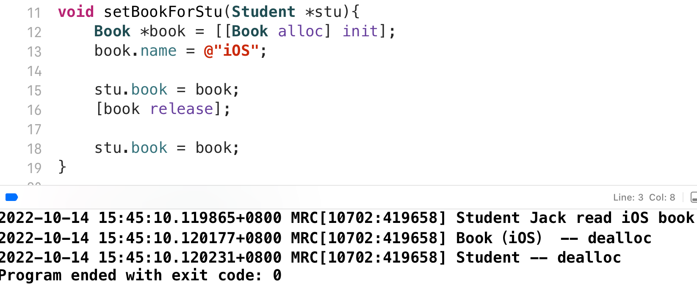

## Autoreleasepool 自动释放池

- 自动释放池是OC的内存自动回收机制
- 当自动释放池销毁时，池里的所有对象都会调用一次 **release** 方法

关于 **Autoreleasepool** 的详细内容，请参考另一篇文章

## Autorelease 方法

- OC对象只需要发送一条**autorelease**消息（调用**autorelease**方法），就会把这个对象添加到最近的自动释放池中（栈顶）

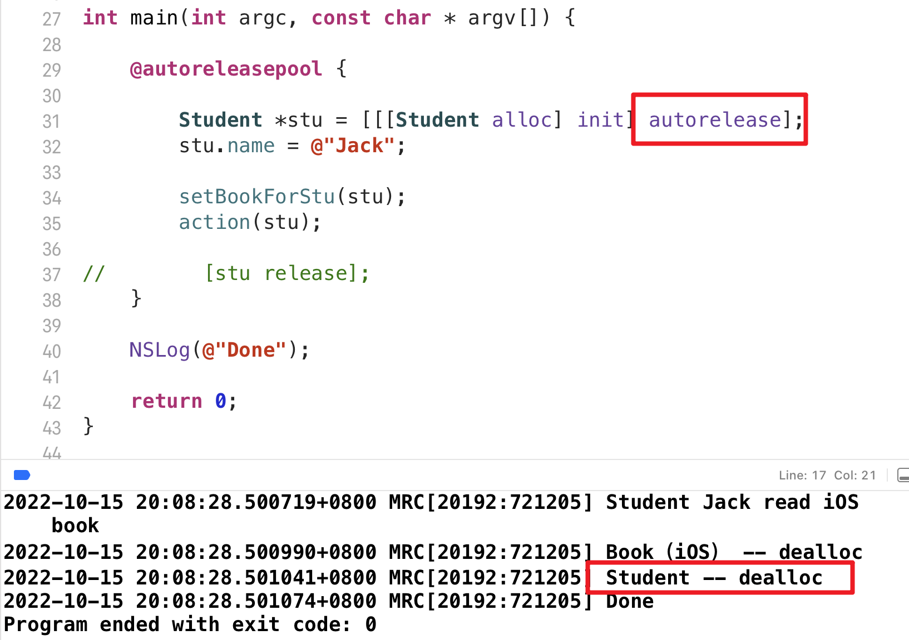

- **autorelease** 方法常用于方法返回创建好的对象，SDK中类方法创建对象默认就是已经**autorelease**过的了

